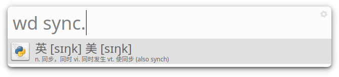

**Maintenance on this repository has been stopped since many distros have removed `albert` due to licensing problems and I've stopped using it. See [albertlauncher/albert#765](https://github.com/albertlauncher/albert/issues/765) for details.**

# albert-wudao
[Albert](https://github.com/albertlauncher/albert) plugin for [Wudao dictionary](https://github.com/ChestnutHeng/Wudao-dict).



## Prequisite
1. Wudao CLI (`wd`) is in the system path.
2. Albert is installed.

## Installation
1. Put the file `wudao.py` into `~/.local/share/albert/org.albert.extension.python/modules/`.
2. Restart Albert.
3. Enable "Wudao Dict" in "Albert settings" > "Extensions" > "Python" > "Wudao Dict".

## Usage

```
wd internationalization.
```

To accelerate the search process and reduce unnecessary queries, we **require** a dot (`.`) added at the end of the word to search.
